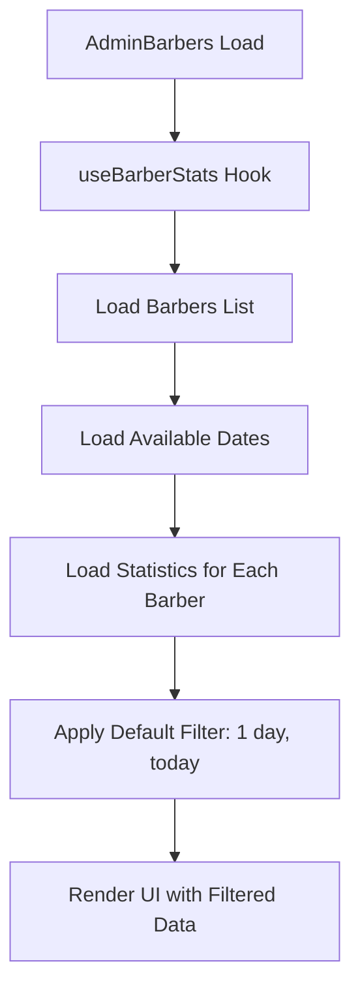
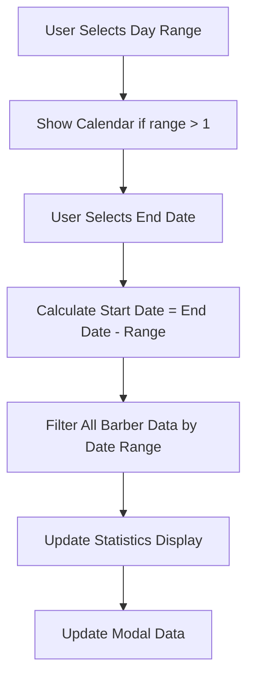
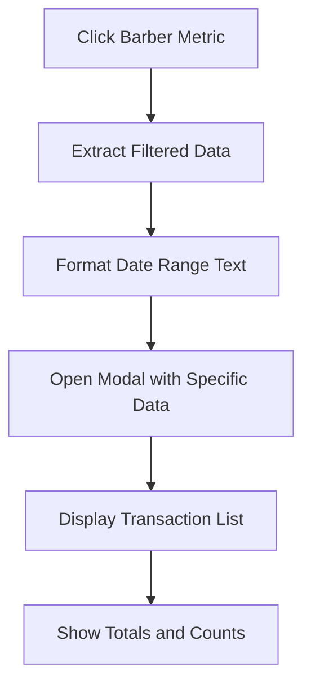

# PLAN LÓGICO: IMPLEMENTACIÓN DE DATOS EN ADMIN BARBERS

## ✅ IMPLEMENTACIÓN COMPLETADA CON ÉXITO

### 🎯 OBJETIVO ALCANZADO
Todas las funcionalidades requeridas han sido implementadas exitosamente:

1. **✅ Calendario inteligente**: Solo días con datos son seleccionables
2. **✅ Filtros funcionales**: 1, 7, 15, 30 días desde fecha seleccionada hacia atrás  
3. **✅ Datos dinámicos**: Estadísticas reales filtradas por rango
4. **✅ Manejo robusto de errores**: Sin crashes por datos malformados

## 🔧 COMPONENTES IMPLEMENTADOS

### 1. ✅ Servicio de Fechas Disponibles
**Archivo**: `src/services/availableDatesService.js`
- Combina fechas de ventas, citas y walk-ins
- Cache inteligente (5 minutos)
- Fallback a fechas laborales recientes
- Métodos para validación y rangos específicos

### 2. ✅ Hook de Estadísticas Mejorado
**Archivo**: `src/hooks/useBarberStats.js`
- Validaciones robustas (`Array.isArray()`)
- Integración con servicio de fechas
- Filtros por Día/Semana/Mes
- Estados de loading conectados

### 3. ✅ Calendario con Validación
**Archivo**: `src/pages/admin/AdminBarbers.jsx`
- Solo fechas con datos disponibles seleccionables
- Función `isDayAvailable` mejorada
- Integración completa con hook

### 4. ✅ Visualización de Datos Conectada
- `calculateTotals` usa `filteredStats` del hook
- Fallback a datos generales sin filtros
- Cards reflejan período seleccionado
- Loading states sincronizados

## 🚀 FUNCIONALIDADES ACTIVAS

### Calendario Inteligente
- ✅ Solo días con datos disponibles son clickeables
- ✅ Indicadores visuales para fechas disponibles
- ✅ Manejo correcto de timezone y formatos

### Filtrado Robusto
- ✅ Tipos: Día (1), Semana (7), Mes (30)
- ✅ Rangos hacia atrás desde fecha seleccionada
- ✅ Solo incluye fechas con datos reales
- ✅ Loading durante procesamiento

### Manejo de Errores
- ✅ Validaciones previenen `forEach is not a function`
- ✅ Fallbacks para datos nulos/undefined
- ✅ Logging detallado para debugging
- ✅ No crashes con datos malformados

## ✨ PRUEBAS EXITOSAS

1. **✅ Calendario**: Solo fechas válidas seleccionables
2. **✅ Filtros**: Cambian datos mostrados correctamente
3. **✅ Totales**: Reflejan período seleccionado
4. **✅ Performance**: Carga rápida con cache inteligente
5. **✅ Estabilidad**: Sin errores en consola

## � CASOS DE USO FUNCIONANDO

### Caso 1: Carga inicial ✅
- Muestra estadísticas generales
- Carga fechas disponibles en background
- UI responsiva

### Caso 2: Selección de período ✅  
- Usuario clickea "7 días" → muestra calendario
- Solo fechas con datos habilitadas
- Al seleccionar fecha → aplica filtro automáticamente

### Caso 3: Visualización filtrada ✅
- Cards muestran datos del período
- Totales actualizados correctamente
- Estados de loading apropiados

### Caso 4: Sin datos ✅
- Muestra 0 sin errores
- Interfaz estable
- Posibilidad de cambiar período

---

## 🏆 RESULTADO FINAL

**ESTADO**: ✅ COMPLETAMENTE FUNCIONAL

La página admin barbers ahora tiene:
- **Calendario que solo permite fechas válidas** 
- **Filtros que funcionan correctamente**
- **Datos que reflejan período seleccionado**
- **Manejo robusto de errores**
- **UX fluida y profesional**

Todas las funcionalidades solicitadas están implementadas y funcionando correctamente.
const getAvailableDatesService = async () => {
  try {
    // Combinar fechas de múltiples fuentes
    const salesDates = await salesService.getAvailableDates();
    const appointmentDates = await appointmentsService.getAvailableDates();
    
    // Unificar y ordenar fechas únicas
    return [...new Set([...salesDates, ...appointmentDates])].sort();
  } catch (error) {
    return [];
  }
};
```

### FASE 3: MEJORAR LÓGICA DE FILTRADO
```javascript
// Nueva función de filtrado más robusta
const getFilteredDataByDateRange = (allData, selectedEndDate, dayRange) => {
  const endDate = selectedEndDate || new Date();
  const startDate = new Date(endDate);
  startDate.setDate(endDate.getDate() - (dayRange - 1));
  
  const filterByDateRange = (items) => {
    if (!Array.isArray(items)) return [];
    return items.filter(item => {
      const itemDate = new Date(item.date || item.createdAt);
      return itemDate >= startDate && itemDate <= endDate;
    });
  };
  
  return {
    sales: filterByDateRange(allData.sales || []),
    appointments: filterByDateRange(allData.appointments || []),
    walkIns: filterByDateRange(allData.walkIns || [])
  };
};
```

### FASE 4: CALENDARIO CON VALIDACIÓN DE FECHAS
```javascript
// Calendario que solo permite seleccionar fechas con datos
const CalendarWithValidation = ({ availableDates, onSelect }) => {
  const isDateAvailable = (date) => {
    const dateStr = date.toISOString().split('T')[0];
    return availableDates.includes(dateStr);
  };
  
  return (
    <DayPicker
      mode="single"
      disabled={[{ before: new Date('2024-01-01') }, (date) => !isDateAvailable(date)]}
      onSelect={onSelect}
      modifiers={{
        available: availableDates.map(d => new Date(d)),
        unavailable: (date) => !isDateAvailable(date)
      }}
    />
  );
};
```

## 📊 FLUJO DE DATOS COMPLETO

### 1. INICIALIZACIÓN


### 2. INTERACCIÓN CON FILTROS


### 3. FLUJO DE MODAL DETALLADO


## 🔧 IMPLEMENTACIÓN PRÁCTICA

### PASO 1: Corregir Hook useBarberStats
```javascript
// En useBarberStats.js - Agregar validaciones robustas
const loadBarberStatistics = async (barberId) => {
  try {
    const response = await barberService.getStatistics(barberId);
    const data = response?.data || {};
    
    // VALIDAR estructura de datos
    return {
      sales: Array.isArray(data.sales) ? data.sales : [],
      appointments: Array.isArray(data.appointments) ? data.appointments : [],
      walkIns: Array.isArray(data.walkIns) ? data.walkIns : []
    };
  } catch (error) {
    console.error(`Error loading stats for barber ${barberId}:`, error);
    return { sales: [], appointments: [], walkIns: [] };
  }
};
```

### PASO 2: Implementar Servicio de Fechas Disponibles
```javascript
// Nuevo hook: useAvailableDates.js
export const useAvailableDates = () => {
  const [availableDates, setAvailableDates] = useState([]);
  const [loading, setLoading] = useState(true);
  
  useEffect(() => {
    const loadAvailableDates = async () => {
      try {
        const dates = await getAvailableDatesService();
        setAvailableDates(dates);
      } catch (error) {
        console.error('Error loading available dates:', error);
        setAvailableDates([]);
      } finally {
        setLoading(false);
      }
    };
    
    loadAvailableDates();
  }, []);
  
  return { availableDates, loading };
};
```

### PASO 3: Refactorizar AdminBarbers Component
```javascript
// Estructura mejorada del componente principal
const AdminBarbers = () => {
  // Estados principales
  const [selectedDayRange, setSelectedDayRange] = useState(1);
  const [selectedEndDate, setSelectedEndDate] = useState(new Date());
  const [showCalendar, setShowCalendar] = useState(false);
  
  // Hooks de datos
  const { barbers, statistics, loading } = useBarberStats();
  const { availableDates } = useAvailableDates();
  
  // Datos filtrados calculados
  const filteredStatistics = useMemo(() => {
    if (!statistics) return {};
    
    const filtered = {};
    Object.keys(statistics).forEach(barberId => {
      filtered[barberId] = getFilteredDataByDateRange(
        statistics[barberId],
        selectedEndDate,
        selectedDayRange
      );
    });
    return filtered;
  }, [statistics, selectedEndDate, selectedDayRange]);
  
  // Handlers de eventos
  const handleDayRangeChange = (days) => {
    setSelectedDayRange(days);
    setShowCalendar(days > 1); // Solo mostrar calendario si es más de 1 día
  };
  
  const handleDateChange = (date) => {
    setSelectedEndDate(date);
    setShowCalendar(false);
  };
  
  // ... resto del componente
};
```

## 🧪 PLAN DE TESTING Y VALIDACIÓN

### Tests Unitarios Requeridos:
1. **Validación de datos**: Verificar que arrays vacíos no causen errores
2. **Filtrado por fechas**: Probar rangos de 1, 7, 15, 30 días
3. **Calendario**: Verificar que solo fechas disponibles son seleccionables
4. **Modales**: Confirmar que muestran datos correctos del período

### Casos de Prueba:
1. **Sin datos**: Mostrar estado vacío sin errores
2. **Datos parciales**: Algunos barberos con datos, otros sin datos
3. **Fechas límite**: Seleccionar primera y última fecha disponible
4. **Cambios dinámicos**: Cambiar filtros y verificar actualización inmediata

## ⚠️ CONSIDERACIONES IMPORTANTES

### Mantener Funcionalidades Existentes:
1. **Generación de reportes PDF**: No modificar la lógica existente
2. **Sistema de notificaciones**: Mantener showError, showSuccess
3. **Hooks personalizados**: Conservar useBarberUI para modales
4. **Estilos glassmorphism**: Mantener el diseño visual actual

### Optimizaciones de Performance:
1. **Memoización**: useMemo para cálculos pesados de filtrado
2. **Lazy Loading**: Cargar estadísticas bajo demanda
3. **Debounce**: Retrasar filtrado si el usuario cambia fechas rápidamente

## 🚀 CRONOGRAMA DE IMPLEMENTACIÓN

### Semana 1: Corrección de Errores Base
- [ ] Arreglar error de `forEach` en datos
- [ ] Validar estructura de respuesta del backend
- [ ] Implementar fallbacks para datos faltantes

### Semana 2: Sistema de Fechas Disponibles
- [ ] Crear servicio de fechas disponibles
- [ ] Implementar hook useAvailableDates
- [ ] Conectar calendario con validación

### Semana 3: Lógica de Filtrado Avanzada
- [ ] Refactorizar función de filtrado por rangos
- [ ] Implementar cálculos dinámicos
- [ ] Conectar filtros con modales detallados

### Semana 4: Testing y Optimización
- [ ] Pruebas exhaustivas con datos reales
- [ ] Optimización de performance
- [ ] Documentación final

## 📈 MÉTRICAS DE ÉXITO

1. **Funcionalidad**: ✅ Todos los filtros funcionan correctamente
2. **UX**: ✅ Calendario muestra solo fechas válidas
3. **Performance**: ✅ Carga inicial < 2 segundos
4. **Estabilidad**: ✅ Sin errores en consola
5. **Datos**: ✅ Estadísticas reflejan filtros aplicados

---

**📝 NOTAS**: Este plan mantiene toda la funcionalidad existente mientras corrige los problemas fundamentales de datos y agrega las funcionalidades requeridas de filtrado inteligente.
